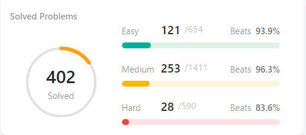

 
### Hye, ሰላም 
I'm Henok.

## I am a Software Engineer & Data Scientist.

Hello there!☺️I am a software engineer and a data scientist with a strong foundation in machine learning, software engineering, networking, and security.

**Connect with me**

 

  
  
<a href="https://github.com/Henokaa/Datastructure-leetcode-practice2"> Leetcode </a>
 
For me, mastery comes not just from learning, but from putting that knowledge into practice. That's why I'm always looking for new projects and opportunities to hone my skills and make a positive impact.

Thanks for visiting my portfolio, and feel free to contact me to discuss potential collaborations.

- 👯 I’m looking to collaborate with others and work on projects
- 🥅 2022 Goals: Contribute to Open Source projects
- ⚡ Fun fact: I love my work

 

[website]: https://codeSTACKr.com
[course]: http://vsCodeHero.com
[twitter]: https://twitter.com/codeSTACKr
[youtube]: https://youtube.com/codeSTACKr
[instagram]: https://instagram.com/codeSTACKr
[linkedin]: https://linkedin.com/in/codeSTACKr
[webdevplaylist]: https://www.youtube.com/playlist?list=PLkwxH9e_vrAJ0WbEsFA9W3I1W-g_BTsbt
[jsplaylist]: https://www.youtube.com/playlist?list=PLkwxH9e_vrALRJKu7wfXby3MKeflhTu6B
[cssplaylist]: https://www.youtube.com/playlist?list=PLkwxH9e_vrALSdvZuEh6gqQdmDoDIoqz4
[reactplaylist]: https://www.youtube.com/playlist?list=PLkwxH9e_vrAK4TdffpxKY3QGyHCpxFcQ0
